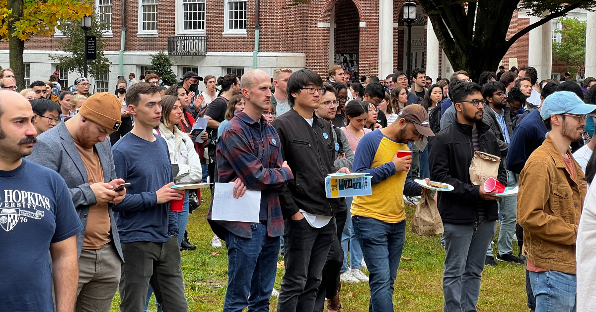

This [article](https://www.ueunion.org/ue-news/2023/the-road-to-collective-bargaining-for-tru-ue) was originally published in UE news on June 3, 2023.

{: .centered} 
TRU-UE launches their card campaign with a rally on October 25, 2022.
{: .centered} 

**By Ali Siddiqui, Kristin Brig-Ortiz, and Andrew S Eneim, TRU-UE**

Graduate workers at Johns Hopkins University began collective bargaining as Teachers and Researchers United-United Electrical, Radio and Machine Workers of America (TRU-UE) with the university administration on May 10, 2023. Earlier this spring, graduate students at Hopkins won a historic vote for the formation of TRU-UE with a 97 percent majority, with 2,053 graduate students voting yes and 67 voting no. TRU-UE now represents around 3,200 PhD workers across the Johns Hopkins Homewood, East Baltimore and Washington DC campuses.

The Bargaining Committee’s current proposals are a result of years of grassroots organizing over important issues that have plagued the graduate student community at JHU. We are demanding a guaranteed, on-time, respectable living wage; meaningful and effective grievance procedures; safe and reliable transport and workspace facilities; worker protection for international students; and a long-term, serious commitment to the city of Baltimore, in which the university is based. 

The unionization movement started in 2014, when the university administration began implementing the new strategic plan for the next decade.This new plan included reducing the number of graduate students on campus and hiring more adjunct faculty for teaching. In an academic culture where graduate students are already at the bottom of the feeding chain, this was a breaking point. A group of PhD students responded by initiating the TRU campaign and started organizing around the issue of increasing graduate student voices in decision making on campus. Then, in 2016, the National Labor Relations Board (NLRB) voted 3-1 that graduate students serving as teaching assistants and research assistants were university employees with a right to collectively bargain. At this point, TRU moved towards a union election to formalize its collective bargaining rights on campus.

It took longer than planned for TRU to elect a union, thanks in part to changes under the Trump administration, the COVID-19 pandemic, and the university’s continued insistence that grad students are not employees. Even so, TRU’s advocacy in different areas of grad student and campus life led to meaningful wins, particularly securing a [dental and vision health insurance coverage package for all Arts & Sciences grad students](https://www.jhunewsletter.com/article/2017/09/editorial-we-must-continue-the-fight-for-graduate-student-healthcare), [paid parental leave](https://www.jhunewsletter.com/article/2017/09/university-grants-grad-students-parental-leave), and [COVID emergency relief funds](https://www.jhunewsletter.com/article/2021/06/hopkins-will-provide-additional-covid-19-relief-funds-to-students) across all campuses. The fact that such benefits were not already in place at a prestigious university like JHU says everything about the state of graduate student affairs in our universities. 

TRU organizers have also protested alongside other campus activist organizations. Starting in 2018, TRU joined Students Against Private Police (SAPP) and Refuel Our Future to organize against contracts that Hopkins had with the US Department of Immigrations Customs and Enforcement (ICE), forcing JHU [to drop its contracts with ICE in September 2019](https://www.jhunewsletter.com/article/2019/09/university-will-not-renew-its-contracts-with-ice). The following year, TRU members were involved with the [Garland Hall Sit-In in May 2019](https://www.jhunewsletter.com/article/2019/05/university-leadership-condemns-escalation-of-garland-sit-in) to protest the proposed JHU private police force. Since then, the union has stood in solidarity with a number of labor unions and other local organizations in the Baltimore community as they fight for the rights they deserve. They always have our backs, so we need to have theirs! 

In September of 2021, the TRU Organizing Committee unanimously voted to affiliate with UE and began preparing for a card campaign to finally win legal recognition. This choice was an easy one, as we quickly realized that our values of rank-and-file democracy and social justice are aligned with UE. This was the beginning of a relationship that would quickly grow into an organized, mobilized, and dedicated bargaining unit that was ready to take the respect and dignity we deserve. Grad workers across JHU were sick and tired of the mistreatment we faced as we were forced to work through COVID in substandard facilities without access to reliable testing and PPE, and throughout the following year we grew through our deep dedication to the rank-and-file driven campaign.

2022 was a pivotal year for the campaign, as TRU had more organizers than ever before. Once there was a steady organizing committee of more than 150 graduate students, we publicly launched our card campaign in late October, with a huge rally. By mid-November, over 2,000 grad students had signed their cards. As expected, Hopkins rejected our request for voluntary recognition, and we then submitted our cards to the NLRB, while planning for our union election at the beginning of the spring semester. During January 30-31, 2023, over 60 percent of all graduate students at JHU went to the polls. As the votes were being counted in the local NLRB office in downtown Baltimore, the sound of “yes” echoed around the room hundreds of times over; over 97% of votes were union YES. Before the official count was even announced, we knew we had made it. 

After hearing from other unions’ experiences, we organized a bargaining committee election. We broke the university into five divisions, and each division voted for four to five bargaining committee representatives. We elected 22 members who would represent TRU-UE at the bargaining table. The bargaining committee prepared for negotiations over the next month until their first bargaining session on May 10, 2023. To show support for the elected bargainers, TRU held a huge rally in Wyman quad in front of Shriver Hall, the building in which the first bargaining session took place. Through the rally, the union definitely caught the attention of the university administration, who have since complained about how the rally-goers “damaged new sod.”

When we think back on our wins, particularly this year, we have witnessed an incredible amount of dedicated and targeted organizing in departments and labs across campus that has led to increased awareness of and involvement in the campaign. Since we began organizing with UE last year, we have seen our organizing core grow to over 160 active organizers covering nine university divisions. This number is still growing. Through our organizing, we have especially focused on spaces where our reach was limited to communicate about the unionization effort as far and wide as possible. To do so, we had to create building leads and divisional coordinators who worked with department organizers to perform lab and office walkthroughs, coordinate one-on-one conversations, and ensure each and every graduate student was reached. Our victories are thus a testament to the hard work of all the department organizers who were relentless in their outreach and who made sure that by the day of the union election vote, every graduate student on campus had signed up to come to the polls.

_TRU members were assisted by Field Organizers **Lyndsey O’Day** and **Valentina Luketa** and Project Staff **Royce Brown**, **Andrew Eneim**, **Townsend Nelson** and **Peter Weck**._
