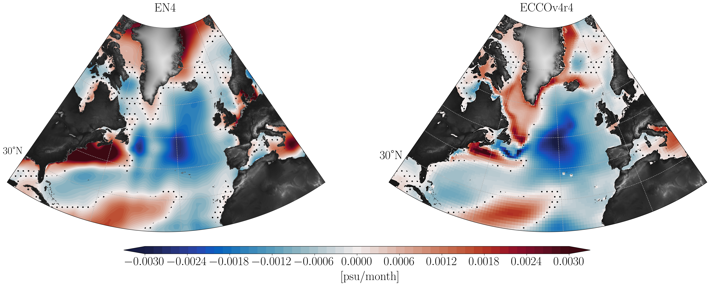
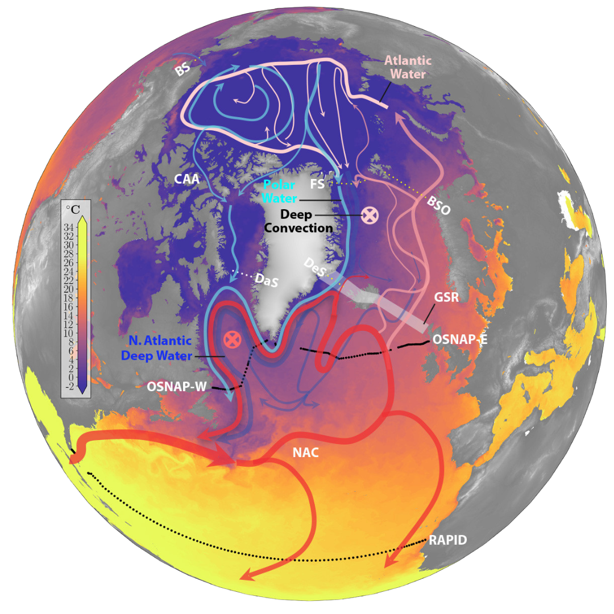

## {{ page.title }}
{: .centered }

I am broadly interested in the ocean's role in Earth's climate. For my PhD dissertation, I have been investigating mechanisms of decadal changes in temperature and salinity in the subpolar North Atlantic. I do this using a combination of computational and modeling tools such as [ECCO](https://www.ecco-group.org/) and [CESM](https://www.cesm.ucar.edu/) model output along with developing conceptual models for such variability. I am also interested in the Atlantic Meridional Overturning Circulation (AMOC), its variability and impact on long term climate. I have been fortunate enough to collaborate with some amazing people on some really fun projects, which are listed below.  

## Decadal variability in the subpolar north Atlantic

In the first chapter of my dissertation, we investigate salinity variability in the eastern subpolar north Atlantic which undergoes decadal fluctuations. A large fresh anomaly event occurred during 2012–2016. Using the ECCO state estimate, we diagnose and compare mechanisms of this low salinity event with that of the 1990s fresh anomaly event. We perform a salt mass content budget analysis of the eastern subpolar North Atlantic. It shows that the recent fresh anomaly occurs due to the circulation of anomalous salinity by mean currents entering the eastern subpolar basin from its western boundary via the North Atlantic Current. This is in contrast to the early 1990s, when the dominant mechanism governing the fresh anomaly was the transport of the mean salinity field by anomalous currents across the southern boundary of the subpolar North Atlantic.

Spatial distribution of linear trends in the upper-ocean salinity (0–200 m) over 2005–2016 using monthly mean fields of (a) EN4 and (b) ECCOv4r4. Dotted regions display insignificant trends calculated using the students-t test with a p-value of 0.05. From Siddiqui et. al. (under review in JGR Oceans). 
{: .centered}

## AMOC-Arctic interactions

The Atlantic Meridional Overturning Circulation (AMOC) plays a significant role in the global climate system, and its behavior in a warming climate is a matter of significant concern. The AMOC is thought to be driven largely by ocean heat loss in the subpolar North Atlantic Ocean, but recent research increasingly emphasizes the importance of the Arctic Mediterranean for the AMOC. In turn, the AMOC may influence the Arctic heat budget through its impact on poleward heat transport. Hence, understanding the processes that link the AMOC and Arctic is critical for our ability to project how both may evolve in a warming climate. In this paper we review some of the recent research that is shaping our thinking about the AMOC and its two-way interactions with the Arctic. I am also very interested in carrying out further work in this area for my postdoc! Feel free to get in touch if you would like to collaborate or have an opening for a postdoc, I'm on the market!

{: .centered}
Schematic of the horizontal circulation in the North Atlantic and Arctic Mediterranean. From [Weijer et. al. 2022](https://doi.org/10.5670/oceanog.2022.130)
{: .centered}

We also wrote a recent paper, [Haine et. al. 2023](https://doi.org/10.1098/rsta.2022.0185) for a special issue of the Philosophical Transactions of the Royal Society, where we highlight our current knowledge on the impact of Arctic freshwater on the AMOC. 

## Computational Oceanography

I have been fortunate enough to work on the Poseidon project in Tom Haine's [group](https://sites.krieger.jhu.edu/haine/people/) which is building infrastructure and benchmarking ultra-high-resolution realistic ocean circulation solutions. This led me to learn so much about open-source software development for Oceanographers, all thanks to [Mattia Almansi](https://github.com/malmans2) and [Miguel Jimenez-Urias](https://github.com/Mikejmnez). I also learned immensely while working on various benchmarking tests for data transfer as part of the Poseidon project. You can read more about these projects in the papers for [OceanSpy](https://doi.org/10.21105/joss.01506) and [Computational Oceanography](https://doi.org/10.1175/BAMS-D-20-0258.1). 
