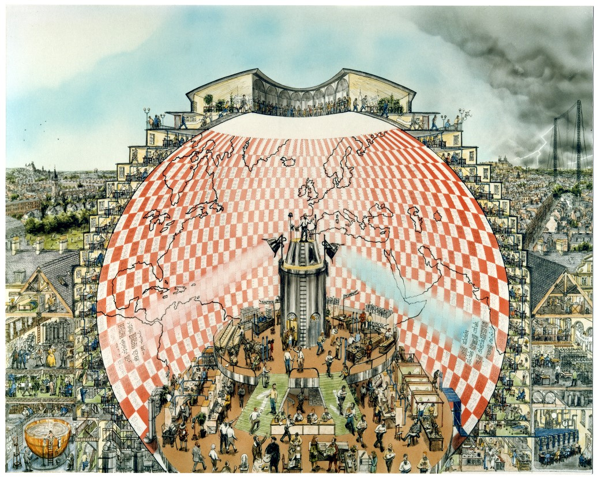

## Instructor 
{: .centered}

I was awarded the Johns Hopkins [Dean's Teaching Fellowship](https://krieger.jhu.edu/research/deans-teaching-fellowship/) during Fall 2023, which allows advanced PhD candidates to propose, design, and teach an undergraduate seminar course at Hopkins. As part of the fellowship, I taught a course titled, _A Modern History of Climate Science_. It has been a passion project for a long time and I'm very happy to finally make it happen! 

The course charts the evolution of the field of climate science over the last 250 years. We explore the history of scientific development that led to advances in climate research in the 19th and 20th century. We also explore the political and social context in which climate science evolved in the West and the backlash of climate change denial that developed due to the influence of the fossil fuel industry. While this course is focused on history, students are also exposed to introductory scientific and technical concepts needed to understand basic climate science.

I am also very excited to continue developing and improving this course in the future both at the undergrad and graduate level. I'm more than happy to hear from you if you have suggestions or want to collaborate! 

[Syllabus](./docs/Syllabus_climatehistory_AS.270.356.FA23.pdf) 

[Course feedback](./docs/AS.270.356.01.FA23AModernHistoryofClimateScience_AliSiddiqui.pdf)

“Weather Forecasting Factory” by Stephen Conlin, 1986. Based on the description in Weather Prediction by Numerical Process, by L.F. Richardson, Cambridge University Press, 1922, and on advice from Prof. John Byrne, Trinity College Dublin. Image: ink and water colour, c. 50 x 38.5 cm. © Stephen Conlin 1986. All Rights Reserved ´. (Courtesy: Hendrik Hoffmann, School of Mathematics & Statistics, University College Dublin)
{: .centered}

## Teaching Assistant
{: .centered}

- Guided Tour of the Planets, Spring 2022, 2023 [TA feedback](./docs/AS.270.114.01.SP22GuidedTourThePlanets_KevinLewis.pdf)
- Oceans and Atmospheres, Spring 2020 [TA Feedback](./docs/AS.270.224.01.SP20Oceans&Atmospheres_DarrynWaugh.pdf)
- Introduction to Global Environmental Change, Fall 2020

